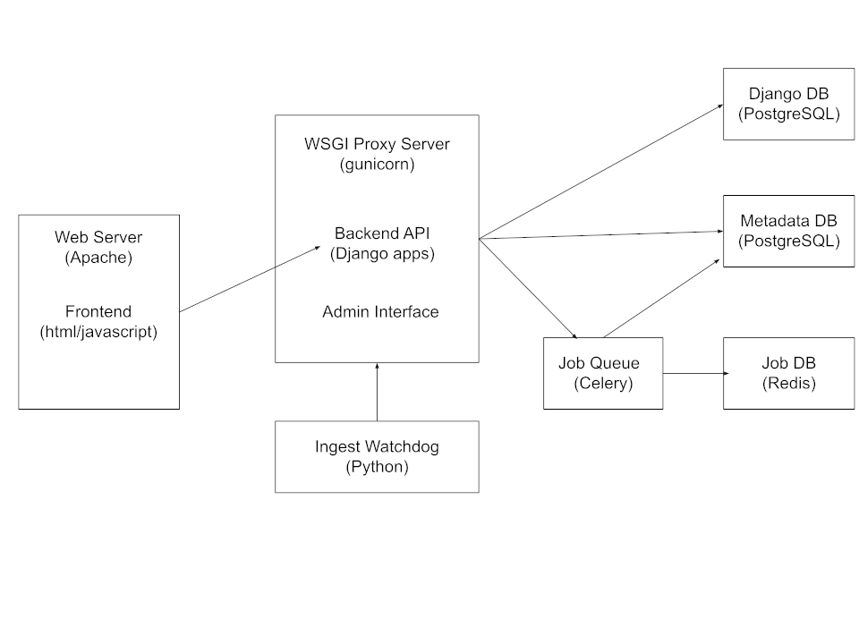

Lick Archive Arctecture
=======================

The above diagram shows the architecture for the Lick Archive.

Frontend
--------
The front end consists of the apache webserver and webpages. The javascript in 
the frontend communicates with the backend on localhost:8000

Backend API
-----------
The backend runs in a `Gunicorn <https://gunicorn.org/>`_ WSGI proxy server
and provides an API for the frontend to access. Some portions of this API are accessible to the 
internet for downloading files and viewing headers.  The API is implemented 
by multiple `Django <https://docs.djangoproject.com/en/5.1/>`_ apps using 
the `Django REST Framework <https://www.django-rest-framework.org/>`_.

The backend implments query, header download, file donwload, and tarball downloads.
See TODO for detailed API documentation.

The backend implements an authentication scheme using the users and password hashes from
the scheduling software database and Django session authentication. It authorizes access to
proprietary data using the rules in TODO.

Admin Interface
---------------
The archive currently supports the `Django Admin Interface <https://docs.djangoproject.com/en/5.1/ref/contrib/admin/>`_,
however it is not available externally. Currently its use is limited because users are synced via a cronjob
from the scheduling software's database.  It can however create/delete staff and admin users which are not 
overwritten by the cronjob.

Ingest Workflow
---------------
The ``ingest_watchdog`` service is a Python application that will run as a Linux systemd service. 
It's job is to monitor the archive NFS mounts for new data, and notify the 
Metadata Ingest REST API of the new file.

The Ingest API is run by the ingest Django app running in the backend gunicorn process. It creates
a a background job to read a new file's metadata, determine who can access it, and ingests it into 
the archive's database. The job's are managed using `Celery <https://docs.celeryq.dev/en/stable/index.html>`_,
using a `Redis <https://redis.io/>`_ database to persist the jobs.

Databases
---------
The archive uses two databases in a single PostgreSQL cluster. The ``archive`` database stores
metadata about the files in the archive and who can access those. This database is managed 
by the `SQLAlchemy <https://www.sqlalchemy.org/>`_ ORM.

The ``archive_django`` database is used by Django and stores user information and django session
information.  It also stores override access information.

.. _architecture_simplification:

Architecture simplification
---------------------------
There are a few areas in which the archive's architecture was overdesigned, and could be
simplified.

* *Ingest Workflow* Originally the ``ingest_watchdog`` service was intended to run 
  a different host and notify the archive via the REST API. This has changed and this Workflow
  is a good candidate for simplification. Having the watchdog service directly load the
  metadata into the database would eliminate a Django app and the dependencies on Celery
  and Redis.

* *Override Access Information* The override access information was intended to be editable
  via the Django admin interface, so it was also placed in the ``archive_django``, 
  however this has not been implemented, so it could be moved to the ``archive``
  database to simplify the authorization code.

* *Multiple ORMs* using the SQLAlchemy ORM along with the Django ORM complicates the archive.
  Specifically in the ``lick_archive.apps.sqlalchemy_django_utils.py`` file. However, at this
  point swithcing to using only one ORM would be a significant rewrite.

Major Software Dependencies
===========================

1. KROOT and LROOT.
   The archive requires that KROOT and LROOT be installed to interface with external UCO software.

2. `PostgreSQL <https://www.postgresql.org/>`_
    The metadata for the files in the Searchable Archive is stored here for querying. The metadata used by Django Apps will also be stored here.

3. `Django`_
    This python package is the framework for the applications that will implement the web APIs in the Searchable Archive.

4. `Django Rest Framework <https://www.django-rest-framework.org/>`_
    Helps make the web APIs.

5. `Celery <https://docs.celeryq.dev/en/stable/index.html>`_
    Celery is a task queue management system used to handle slow background tasks that should not hold up HTTP requests from clients. 

6. `Redis <https://redis.io/>`_
    Redis is an in memory database used as a message broker by Celery.

7. `Gunicorn`_
    A WSGI webserver that bridges between Apache and python applications.

8. `SQLAlchemy <https://www.sqlalchemy.org/>`_
    A Python database toolkit for accessing the database. We use its ORM to define the database's
    schema and to access the database without having to hardcode SQL.

9. `Astropy <https://www.astropy.org/>`_
    A Python package for astronomy software. We use it for reading FITS files.

10. `pgspehre <https://github.com/akorotkov/pgsphere>`_
    A PostgreSQL plugin for Spherical Coordinates. We use it for fast indexed queries on ra/dec. The 
    main github link for this is out of date, but I couldn't find a better one. But Debian some
    how gets new updates in its packages? 

11. `Python <https://python.org>`_
     All software is written in Python.

12. `Ansible <https://www.ansible.com/>`_
     Ansible is used to deploy the archive.

13. `NPM <https://www.npmjs.com/>`_
     NPM is used in building the archive's frontend. 

14. `esbuild <https://esbuild.github.io/>`_
     esbuild is used in building the archive's frontend.

15. `jinja <https://jinja.palletsprojects.com/en/stable/>`_
     Jinja is used as a templating framework both within Ansible and for
     building the archive frontend's HTML.
     
