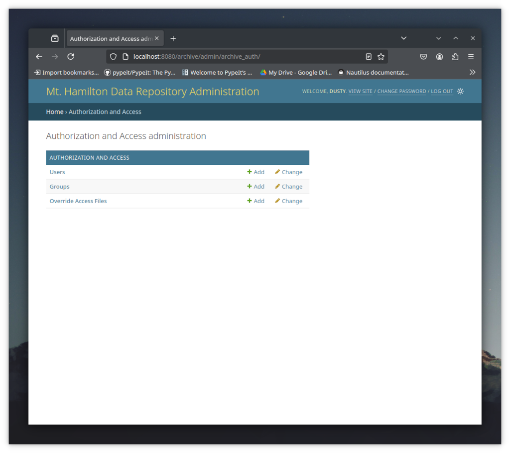

Maintenance
===========

User setup
----------

An admin user for the archive should have sudo access and be in the ``mhdata`` group. 
Before running any maintenance scripts they should switch to that group and also activate the archive's 
python virtual environment::

    $ newgrp mhdata
    $ source /opt/lick_archive/bin/activate

Archive Admin Page
------------------

The archive provides an admin interface that allows for adding and removing users. This
page is only available via localhost, and can be accessed via a ssh tunnel::

    ssh -L 8080:localhost:8080 user@quarry.ucolick.org

The admin page can then be accessed via http://localhost:8080/archive/admin/.
To login, use the superuser  account created :ref:`in the deployment steps <admin_superuser>`.

The ``Users`` section of the admin page can be used to add, delete, and edit users. **However, 
most users are automatically synced every two minutes from the scheduling database, overwriting
any changes made here.** But users marked as *superuser* or *staff* users are **not** synced.
A *superuser* can login to the admin page, and can see all files in the archive. A *staff* user
does not have any special privileges, but this type of account may be used to create a test account
that is not synced from the scheduling database.

The ``Groups`` section of the admin page is not currently used. It could be used to place 
users into groups and give those groups access to certain files in the archive. However
this has not been implemented yet.

The ``Override Access Files`` provide access to the information parsed from ``overide.access`` files
ingested into the archive. (See :ref:`Access Rules <access_rules>`). This was intended to provide an
additional mechanism to create access overrides, but it likely needs more work to be useful.

Logging
-------

The following logs maybe useful for debugging archive issues. Most archive logs are in ``/var/log/lick_archive``.
Log rotation uses the standard ``logrotate`` cron job. See :ref:`Configuration <configuration>` for how logging is configured.

Archive Application Logging
^^^^^^^^^^^^^^^^^^^^^^^^^^^

+-------------------------+--------------------------------------------------------+
| Ingest Watchdog service | ``/var/log/lick_archive/ingest_watchdog.log``          |
+-------------------------+--------------------------------------------------------+
| Django Apps             | ``/var/log/lick_archive/apps.log``                     |
+-------------------------+--------------------------------------------------------+
| Celery tasks            | ``/var/log/lick_archive/celery/<hostname>-<n>.log``    |
+-------------------------+--------------------------------------------------------+
| User sync cronjob       | ``/var/log/lick_archive/sync_archive_users.log``       | 
+-------------------------+--------------------------------------------------------+

The archive backend primarily logs to the ``apps.log``. However ingesting metadata
will also log to the ``ingest_watchdog.log`` file when first detecting a file,
and in the celery task logs for the actual ingest.  The celery task logs are split
into two, one for each celery worker process.

The archive ues a cronjob to sync users from the lick observatory scheduling database
to its own django database. This logs to ``sync_archive_uers.log``.

3rd Party Service Logging
^^^^^^^^^^^^^^^^^^^^^^^^^
+-------------------------+--------------------------------------------------------+
| Celery                  | ``/var/log/lick_archive/celery/<hostname>.log``        |
+-------------------------+--------------------------------------------------------+
| Celery tasks            | ``/var/log/lick_archive/celery/<hostname>-<n>.log``    |
+-------------------------+--------------------------------------------------------+
| Gunicorn Error          | ``/var/log/lick_archive/gunicorn_error.log``           |
+-------------------------+--------------------------------------------------------+
| Gunicorn Access         | ``/var/log/lick_archive/gunicorn_access.log``          |
+-------------------------+--------------------------------------------------------+
| Apache Error            | ``/var/log/apache2/error.log``                         |
+-------------------------+--------------------------------------------------------+
| Apache Access           | ``/var/log/apache2/access.log``                        | 
+-------------------------+--------------------------------------------------------+
| Apache Static Error     | ``/var/log/apache2/static_error.log``                  |
+-------------------------+--------------------------------------------------------+
| Apache Static Access    | ``/var/log/apache2/static_access.log``                 |
+-------------------------+--------------------------------------------------------+

The Celery service logs to the ``/var/log/lick_archive/celery`` directory. The
logs are named after the machine's hostname. The controlling daemon logs to
a file without a number suffix, but the workers log to files named ``<hostname>-<n>.log``,
where *n* is the number of the worker process.

The archive's main virtual host logs to the apache ``error.log`` and ``access.log``.
The static virtual host is only used when ssh tunneling to the  Admin page,
and logs to ``static_error.log`` and ``static_access.log``.

Gunicorn serves as proxy server the archive's django apps. Similar to apache, it logs 
to an access and error log.

Checking Archive Status
------------------------

To check if the archive is up
^^^^^^^^^^^^^^^^^^^^^^^^^^^^^

::

    $ sudo systemctl status "postgre*"
    $ sudo systemctl status redis
    $ sudo systemctl status apache2
    $ sudo systemctl status gunicorn
    $ sudo systemctl status celery
    $ sudo systemctl status ingest_watchdog

To check that ingests have been working
^^^^^^^^^^^^^^^^^^^^^^^^^^^^^^^^^^^^^^^

::

    $ ingest_stats_by_date.py *month*

Where *month* can be any month name or 3 letter month abbreviation.
If any of returned lines show ``MISMATCH``, it means the number of files in the 
archive's file system do not match what is in the database. This could be 
innocuous if the file isn't something that shouldn't be ingested, or could
be a failure in the ingest workflow.

To ingest missing metadata
^^^^^^^^^^^^^^^^^^^^^^^^^^
Use ``resync_archive_files.py`` to rescan a directory for files not in the database, and 
to ingest the metadata for those files.  Files can be specified by using a date range, 
a list of files, or an instrument directory name.

::
    # Resync files from May 23, 2019.
    $ resync_archive_files.py --date_range 2019-05-23

    # Resync files in May and June 2019
    $ resync_archive_files.py --date_range 2019-05-01:2019-06-30

    # Resync two specific files
    $ resync_archive_files.py --files /data/data/2019-05/23/shane/b1.fits /data/data/2019-05/23/shane/r1.fits

    # Resync only the AO files in May and June 2019
    resync_archive_files.py --date_range 2019-05-01:2019-06-30 --instruments AO

The above examples only ingest files that are not in the metadata database, or that have a different
size or modification date from what's stored in the database. To force all files to be 
re-ingested::

    # Force re-ingest of files from May 23, 2019.
    $ resync_archive_files.py --force --date_range 2019-05-23

To check for files owned by ``UNKNOWN``
^^^^^^^^^^^^^^^^^^^^^^^^^^^^^^^^^^^^^^^^^^^^^^^^^^^^^

::

    echo "select count(*) from file_metadata where public_date = '9999-12-31';" | psql -U archive -f -

If any ``UNKNOWN`` files are found, verify which users should be able to see the files. Then add those users
either using ``override.access`` files, or by using ``update_authorized_users.py``. 

.. _view_user_access:

To see which users can access a file
^^^^^^^^^^^^^^^^^^^^^^^^^^^^^^^^^^^^

::

    echo "select uda.obid, uda.reason from user_data_access uda, file_metadata fm where uda.file_id = fm.id and fm.filename ='/data/data/2019-05/23/shane/b1.fits';" | psql -U archive

This returns the observer id, and the reason the access was granted.  The reason refers to the rule numbers defined in the :ref:`Access Rules <access_rules>`.

Note that observer id ``-100`` indicates that the file is visible to all users, and ``-101`` indicates the user is unknown. To look up other observer ids::

    echo "select first_name, last_name, username from archive_auth_archiveuser where obid = 600" | psql -U archive -d archive_django

.. _resync_auth:

To resync authorization metadata
^^^^^^^^^^^^^^^^^^^^^^^^^^^^^^^^
If the authorization for a file has changed (because either an override.access file was created, or something in the scheduling database chaged),
the ``resync_auth.py`` script can be used to re-apply the authorization rules (See :ref:`Access Rules <access_rules>`) for those files. Files can be specified
using a list of filenames, a date range, a list of instruments, a list of databasse ids, or a separate file of database ids.

Examples::

    # Resync files with database ids 382, 383
    $ resync_auth.py --ids 382 383

    # Resync files with database ids read from a text file
    $ echo 382 > file_ids
    $ echo 383 >> file_ids
    $ resync_auth.py --id_file file_ids

    # Resync files in May and June 2019
    $ resync_auth.py --date_range 2019-05-01:2019-06-30

To set which users can access a file
^^^^^^^^^^^^^^^^^^^^^^^^^^^^^^^^^^^^

The ``update_authorized_users.py`` script can directly set the user that can access one or more files. However, this will be erased
should an override.access file ingested. Running ``resync_auth.py`` will also undo the results of this script. 

Examples:

    # Make a file public
    $ update_authorized_users set public --files /data/data/2024-12/05/shane/r33.fits

    # Add user to the list of users that can access Shane files on a particular date
    $ update_authorized_users add test_user@example.org --date_range 2024-12-05 --instruments shane

    # Remove a user from a list of users that can files on a particular date
    $ update_authorized_users remove test_user@example.org --date_range 2024-12-05

    # Set a particular file to UNKNOWN, making it invisible to all but admin users
    $ update_authorized_users set unknown --files /data/data/2024-12/05/shane/r33.fits

To check if the user sync cronjob is running correctly::
^^^^^^^^^^^^^^^^^^^^^^^^^^^^^^^^^^^^^^^^^^^^^^^^^^^^^^^^
    $ cd /var/log/lick_archive/
    $ tail sync_archive_users.log 
    INFO     2025-04-07 20:27:02.757 pid:83391 sync_archive_users:main:138 Completed syncing users. Duration: 0:00:00.169757.
    INFO     2025-04-07 20:29:03.748 pid:1905 sync_archive_users:main:138 Completed syncing users. Duration: 0:00:00.424975.
    INFO     2025-04-07 20:31:03.165 pid:2022 sync_archive_users:main:138 Completed syncing users. Duration: 0:00:00.183701.
    INFO     2025-04-07 20:33:02.574 pid:2045 sync_archive_users:main:138 Completed syncing users. Duration: 0:00:00.156700.
    INFO     2025-04-07 20:35:03.003 pid:2077 sync_archive_users:main:138 Completed syncing users. Duration: 0:00:00.196797.
    INFO     2025-04-07 20:37:02.537 pid:2101 sync_archive_users:main:138 Completed syncing users. Duration: 0:00:00.175910.
    INFO     2025-04-07 20:39:02.998 pid:2366 sync_archive_users:main:138 Completed syncing users. Duration: 0:00:00.183328.
    INFO     2025-04-07 20:41:02.413 pid:2624 sync_archive_users:main:138 Completed syncing users. Duration: 0:00:00.184010.
    INFO     2025-04-07 20:43:02.805 pid:2644 sync_archive_users:main:138 Completed syncing users. Duration: 0:00:00.155678.
    INFO     2025-04-07 20:45:02.205 pid:2664 sync_archive_users:main:138 Completed syncing users. Duration: 0:00:00.166640.

To check if the database backups are running correctly
^^^^^^^^^^^^^^^^^^^^^^^^^^^^^^^^^^^^^^^^^^^^^^^^^^^^^^

::

   $ sudo ls -lrt /pg_data/backups/

Make sure there is a recent backup named ``archive_db_YYYYMMDD_HHMM.dump.gz`` and ``archive_db_django_20250407_1500.dump.gz``.

Note that these database backups are intended to protect against administrator error. For disaster recover it's expected that the
the VM is being backed up by a system like Veeam.

